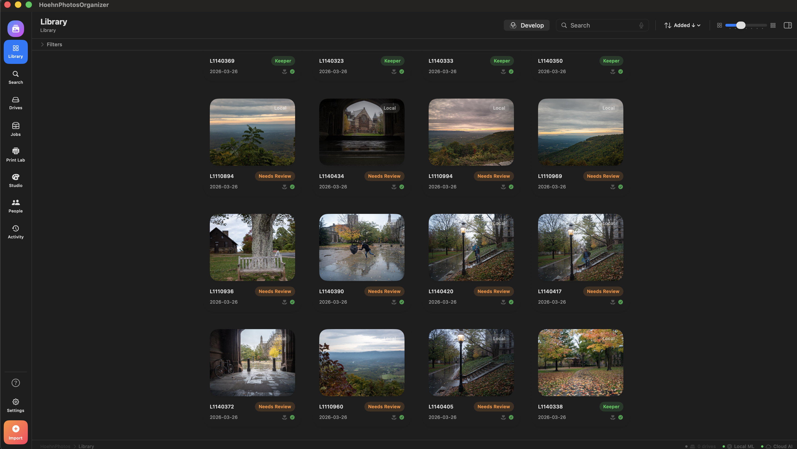
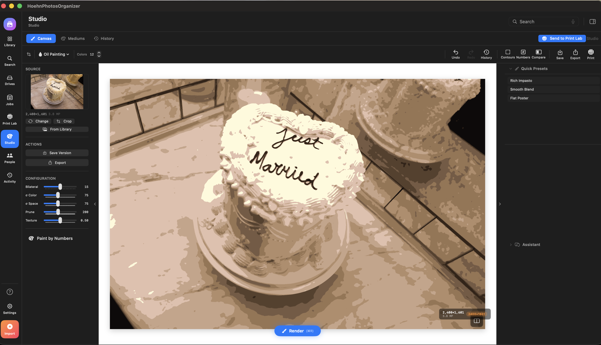
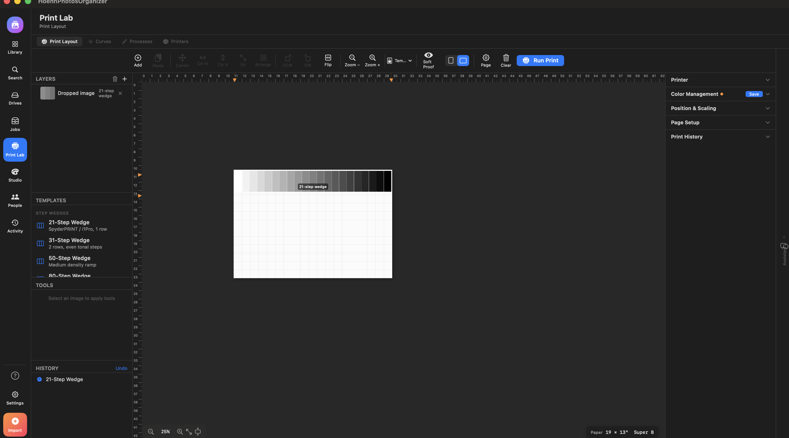

# HoehnPhotosOrganizer

A photo management and creative studio app for macOS and iOS, built with SwiftUI and GRDB.

## Screenshots

| Library | Develop |
|---------|---------|
|  |  |

| Studio | Print Lab |
|--------|-----------|
|  |  |

| AI Assistant |
|--------------|
|  |

## Features

- **Library** — Import, browse, search, and organize photos with CLIP-based semantic search
- **Develop** — Non-destructive photo editing with Camera Raw-style adjustments
- **Studio** — Artistic rendering (oil painting, watercolor, charcoal, graphite, pen & ink, paint-by-number) powered by OpenCV
- **People** — Face detection, clustering, and identity management with SAM2 segmentation
- **Jobs** — Post-import triage workflow with chat-driven labeling and metadata propagation
- **Print Lab** — Fine art print preparation with custom curve profiles and ICC management
- **Collections** — Curate and organize photo sets
- **Search** — Semantic and metadata-driven search across the library

## Project Structure

```
HoehnPhotosOrganizer/     # macOS app target
HoehnPhotosMobile/        # iOS app target
HoehnPhotosCore/          # Shared framework (models, database, sync)
infra/                    # AWS CDK backend (Cognito, S3, DynamoDB, API Gateway)
```

## Dependencies

- [GRDB](https://github.com/groue/GRDB.swift) — SQLite database
- [OpenCV](https://github.com/nicklama/JustTheBinary) — Image processing for Studio rendering
- CoreML models (not included in repo): MobileCLIP, SAM2, OrientationDetector, FilmStripDetector

## Requirements

- macOS 14+ / iOS 17+
- Xcode 16+

## Build

Open `HoehnPhotosOrganizer.xcodeproj` in Xcode and build the desired target. CoreML model packages (`.mlpackage`) must be placed in the project root before building.
